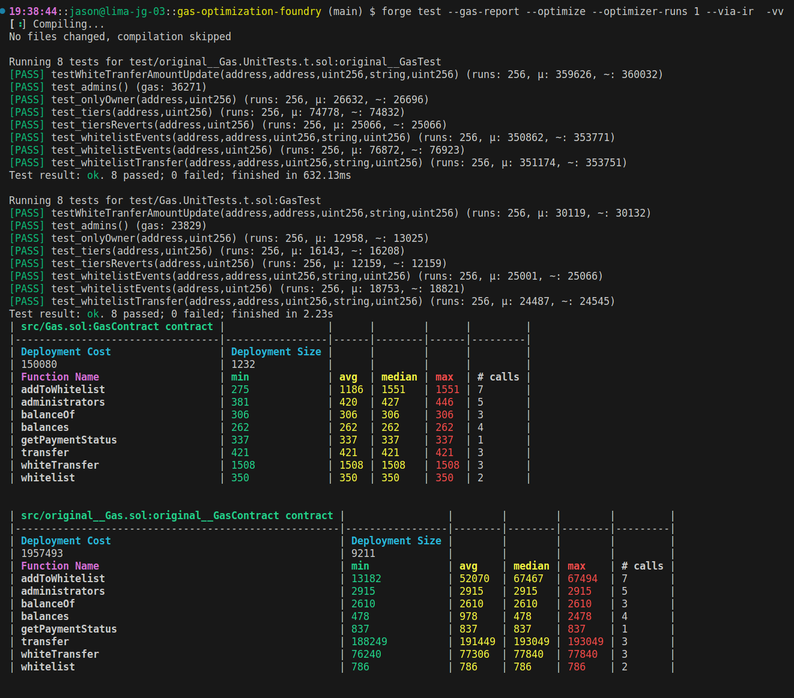

***
# Gas Optimization Challenge 
A gas optimization challenge from the Encode Expert Solidity Bootcamp

- Your task is to edit and optimise the Gas.sol contract. 
- You cannot edit the tests & 
- All the tests must pass.
- You can change the functionality of the contract as long as the tests pass. 
- Try to get the gas usage as low as possible. 

### To run tests & gas report with verbatim trace 
Run: `forge test --gas-report -vvvv`

### To run tests & gas report
Run: `forge test --gas-report`

### To run a specific test
RUN:`forge test --match-test {TESTNAME} -vvvv`
EG: `forge test --match-test test_onlyOwner -vvvv`
  
***

# Optimization Results
Files prefixed with `original` are to represent the initial codebase provided as the challenge.

## Gas Report Comparison
`forge test --rpc-url http://127.0.0.1:8545 --gas-report -vv` 

## Storage Report Comparison
#### Optimized Storage Report:
`sol2uml storage src/GasFlatten.sol -c GasContract -o img/gas-storage-report.svg` 

#### Original Storage Report:
`sol2uml storage src/original__GasFlatten.sol -c original__GasContract -o img/original-gas-storage-report.svg` 

